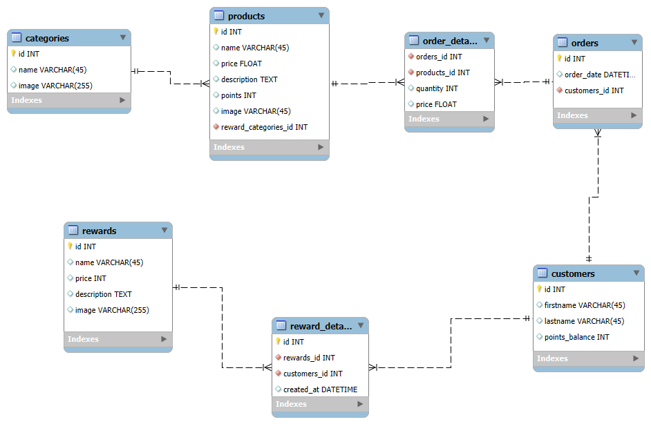

# CENTRAL PERK

Central Perk (Rewards): A reward system management application for the Central Perk coffee shop.

This project consists of a frontend application built with **React** and a backend API built with **Java/Spring Boot**.

# Backend

## Approach

To provide a comprehensive overview of this project, I'll begin by outlining the backend logic. This project utilizes a MySQL database, adhering to a specific schema depicted in this photo.

- This Schema covers 2 major components: the Rewards and the Sales:

**Rewards:**

- Represented by the "rewards" and "reward_details" tables, which store all reward-related information.
- Each reward has a price in the form of points that customers can use to redeem rewards.
- Points are earned through purchasing products at the coffee shop.

**Sales:**

- Represented by the "order" and "order_details" tables, which store all order-related information.
- The platform only covers the part where sales information is needed on a monthly basis, without delving deeply into this aspect.

The main goal of this backend project is to create a REST API using Java and Spring Boot for the frontend application to consume. This REST API should enable the listing of loyal customers, performing CRUD operations for rewards, and retrieving sales information from orders.

example of Central Park API:

- **GET** /api/loyal-customers: Lists all loyal customers.
- **GET, POST (with request body), PUT (with request body), DELETE** /api/rewards/{id}: Performs CRUD operations for the rewards.

## Risks

A potential risk for the backend is the possibility of it not working properly on the server due to differences in environments and configurations. To mitigate this risk, using a containerization tool like Docker is essential.

# Frontend

## Approach

"The frontend of this application is built using the **React.js** library with **Vite** for the build setup. It integrates **Material UI** for reusable UI components, **Redux Toolkit** for state management, and **React Router** for page navigation.

- I also used a 3rd party library for the Circular Progress Bar called **react-circular-progressbar**.
- The UI design was crafted using the Material UI library. This process involved utilizing various UI components, establishing a global theme, and styling the components with Styled Components.

- The frontend includes data such as loyal customers and a list of rewards. These are managed using Redux Toolkit for state management.

## Risks

The frontend must adhere strictly to the provided mockup, which is typically created by a UX designer. In some cases, completing frontend tasks requires review and approval from the UX designer, potentially slowing down the task completion process.

## Highlights:

There are things that I want to point out about the Mockup design and the final product:

- The design system specified the use of the 'Georgia' font, but it was not applied in the mockup design, so I opted for 'Arial' instead.

- The green color used in "Redeem Points this week" (#55A672) was not specified in the design system, so I chose a different shade of green (#2E8B57).
- The font size for the text was not specified in the design system, which resulted in some multi-lined sentences (like "Redeem Points this week") being written into a single line.
- The reward image uploads happen locally without involving a backend, as I later discovered that using a cloud service (e.g., Cloudinary) requires API keys, which are private data. Therefore, the images are not persistent, and the same applies to the newly created, updated, or deleted reward data.

## Technical Documentation

- To Launch the Central Perk Platform, you need to go to the `/frontend` folder, and then run this command :

<code>npm run dev</code>

- Open your favorite internet browser and type the following URL: `http://localhost:5173`. Voilà! The Central Perk app will appear in your browser.
